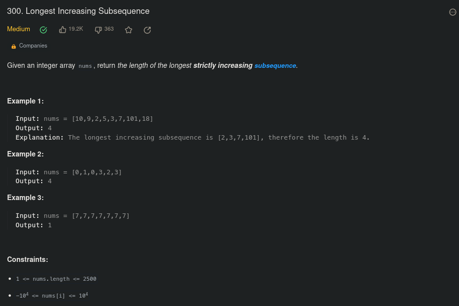
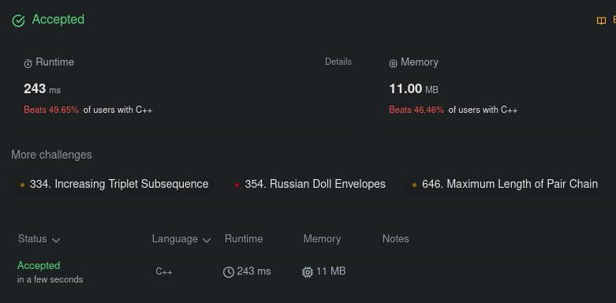
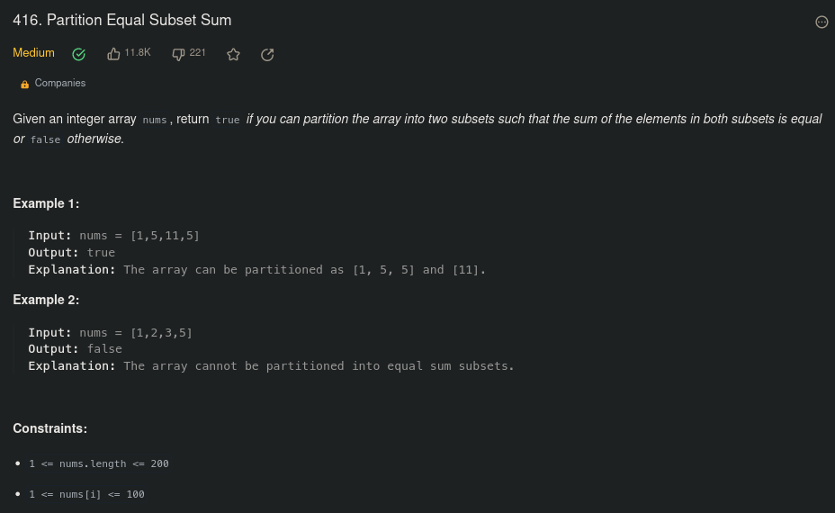
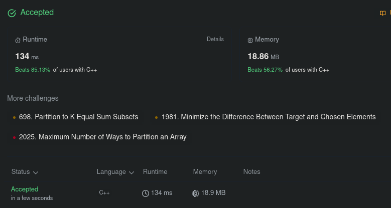
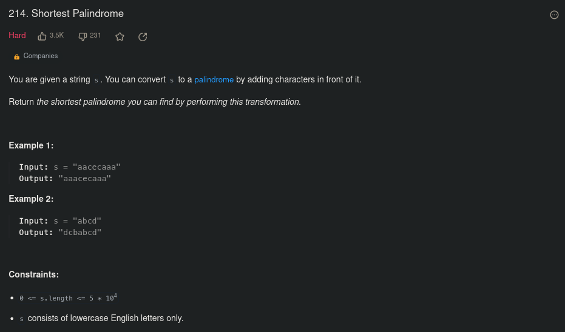
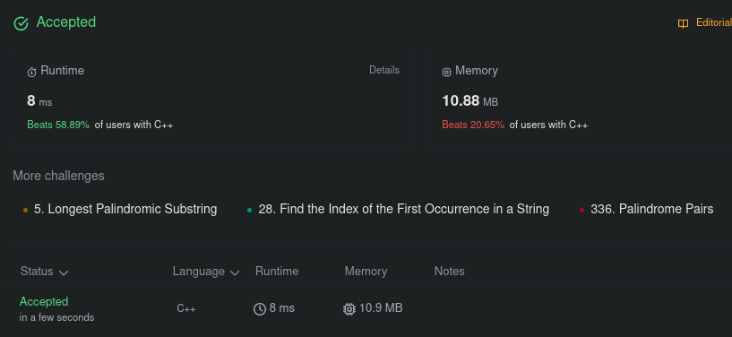

# PD_QuestoesLeetcode

**Número da Lista**: X 
**Conteúdo da Disciplina**: PD 

## Alunos
|Matrícula | Aluno |
| -- | -- |
| 190058587  |  Matheus Raphael Soares de Oliveira |

## Sobre 
Esse projeto tem como objetivo responder 3 perguntas do Leetcode sobre programação dinâmica, de acordo com o que foi estudado em aula sobre 0-1 Knapsack, Biggest Ascending Subsequence e sobre String Similarity aplicado sobre o contexto de palíndromos com o algoritmo de Knuth-Morris-Pratt.

## Screenshots
Questão 1: [Longest Increasing Subsequence](https://leetcode.com/problems/longest-increasing-subsequence/description/)

Questão 2: [Partition Equal Subset Sum](https://leetcode.com/problems/partition-equal-subset-sum/description/)

Questão 3: [Shortest Palindrome](https://leetcode.com/problems/shortest-palindrome/description/)

## Instalação 
**Linguagem**: C++ 

Ter algum compilador C++ e/ou uma conta no Leetcode.

## Uso 
### Localmente:
Caso queira testar localmente, compile o código e o rode com:

    g++ nomedoarquivo.cpp
    ./a.out

Depois coloque algum input de teste.
### Leetcode:
Para responder no Leetcode é necessário logar em sua conta, ir ao link das perguntas e colar apenas a parte da class Solution no campo do código.

